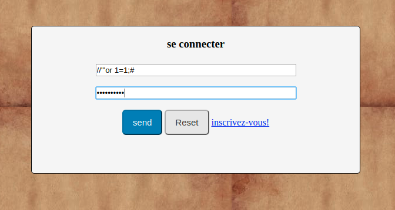
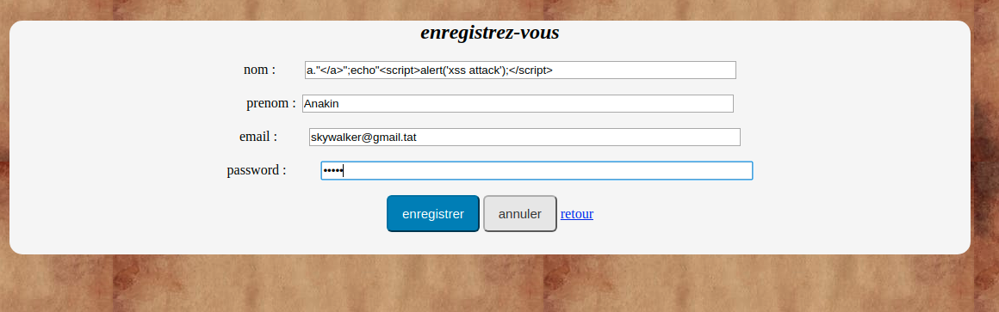
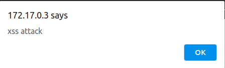

# Execice 1


# Exercice 2


Injection sql utiliser <<  //"'or 1=1;#  >> dans le champs email et n'importe quoi dans le champ *password*.

Attaque XSS persistante (insertion en dure dans la bd d'une ligne de code qui s'exécute à chaque appel de la page listePersonne.php) insertion faite depuis la page insertPersonne.php evec :
   ```
   a."</a>";echo"<script>alert('xss attack');</script>
   ```

Contre mesure: sanitisation des entrées pour les deux types d'attaques


## Tester

### Base de donnée

La base de donnée utilisée est MySQL. Pour nos tests nous avons utilisé l'image Docker mysql qu'on lance avec la lignes lignes de commande suivantes :

 ``` 
   docker run --name mysql_secu -d -e MYSQL_ROOT_PASSWORD=rootroot -e MYSQL_DATABASE=bdsecu mysql
   mysql -h 172.17.0.2 -u root -prootroot < bdsecu-2.sql
 ````

PS: 172.17.0.2  est l'adresse IP du conteneur mysql_secu. Pour le trouver : docker inspect mysql_secu


### Lancer les scripts

Pour lancer les deux versions *attaque* et *contremesure* il faut php d'installé (en plus d'une base de données mysql). Les deux repertoires contiennent des Dockerfiles qui utilisent l'image [php:7.3-apache](https://hub.docker.com/_/php).

On build puis run une image à partir des Dockerfiles.


```
docker build -t attaque .
docker run -p 8080:80 -e HOST_DB=172.17.0.2 --name attaque attaque
```

HOST_DB est l'adresse IP de MYSQL. __Cette variable est indispensable.__

PS :  Dans les deux cas il faut que le repertoire courant soit "/attaque" ou "/contremesure"

Le test se fait dans un navigateur. Si 172.17.0.3 est l'adresse IP du conteneur (docker inspect pour le trouver), l'url de test est : http:172.17.0.2/

Une page qui ressemble à ça va s'afficher :



- Pour l'injection SQL :

Si on met dans le champ *email* la valeur ``` //"'or 1=1;# ``` et n'importe quelle texte dans le champ *password*, on arrive à ce connecter.

- Pour l'injection XSS (persistante)

Il faut d'abord cliquer sur *inscrivez-vous!* puis créer un compte avec un nom qui est en fait un script JS.



Une fois l'utilisateur enregistré, on fait retour pour se connecter, soit avec un vrai compte soit par injection SQL et on pourra voir le resultat de l'execution du script qui a été injecté dans la base de donnée.



__IMPORTANT : Si on utilise la même base de donnée, il faut la vider lorsqu'on veut tester la version *contremesure* après testé la version *attaque*. Vu que le script de l'injection XSS est enregistrée dans la base de donnée.__